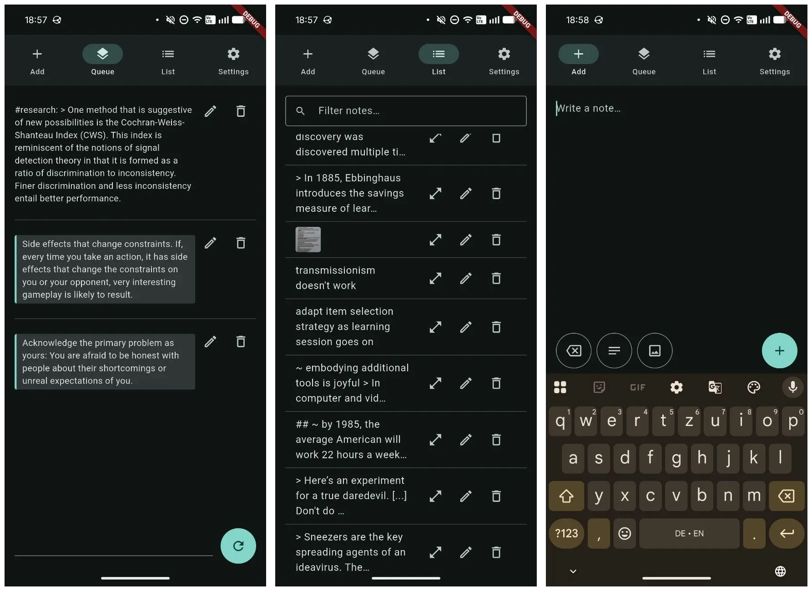

# note



A minimal Flutter app for adding, managing and interacting with plain-text notes, each stored as a small `.json` file on disk.

## Prerequisites

- [Flutter SDK](https://docs.flutter.dev/install) (stable channel)
- Android SDK + NDK (via `flutter doctor` / Android Studio) for the Android target
- Linux desktop build tools:
  - Ubuntu: `sudo apt install cmake ninja-build clang libgtk-3-dev imagemagick`
  - Fedora: `sudo dnf install cmake ninja-build clang gtk3-devel ImageMagick`
- [`just`](https://github.com/casey/just) (optional) — see `justfile` for the dev/build/install shortcuts used below

## Setup

```bash
flutter pub get
```

## Development

```bash
just dev                # or: flutter run -d linux
flutter run -d <device> # Android device/emulator
```


## Build

```bash
just apk                    # debug APK, drops you into its output dir
just reinstall              # release Linux bundle, installed to ~/.local + desktop entry
flutter build apk --debug   # equivalent, manual
flutter build linux         # equivalent, manual
```

Install a built APK: `adb install -r build/app/outputs/flutter-apk/app-debug.apk`

## Data format

Each note is one `*.json` file directly inside a on-disk data folder, a single JSON object:

```json
{
  "body": "the note's single line of text",
  "extra": "optional long-form content",
  "rels": { "arbitrary": "string map" }
}
```

- `body` is always present. Notes are a single line: any newlines typed into a note are collapsed to spaces before the file is written. Content is shown exactly as typed — there's no markdown rendering anywhere in the app.
- `extra` and `rels` are written only when non-empty.
- Any other unrecognised top-level keys are preserved verbatim on write

An optional image is **not** stored in the JSON — it stays a real file in a sibling `images/` folder, named `<note-name>-<timestamp><ext>`, and is matched back to its note by name during the folder scan.

See `lib/models/note.dart` for the read/write logic and `lib/repository/note_repository.dart` for the folder scan + in-memory store.

## Screens

- **Add** — a full-screen text box. "Add" slugs the first few words of the text, appends a random 6-hex-char suffix for uniqueness, collapses any newlines, and writes a new `.json` file to the data folder. "Clear" just resets the text box.
- **Queue** — draws 3 random notes at a time and lists them, each with an "Edit" icon button (jumps to the same form used by Add, prefilled with that note's text, saving back to its file) and a "Delete" icon button (removes it from the list immediately and shows an "Undo" snackbar; the file is only actually deleted from disk once you've interacted with the app twice more without hitting undo). A single "Next" button loads a fresh batch of 3.
- **List** — every note in the data folder, with a filter box at the top that narrows the list to notes containing the typed text. Each row has the same Edit/Delete icon buttons as Queue.
- **Settings** — shows the current data folder and loaded note count, lets you pick a different folder, and (Android only) lets you (re-)grant full disk access.
